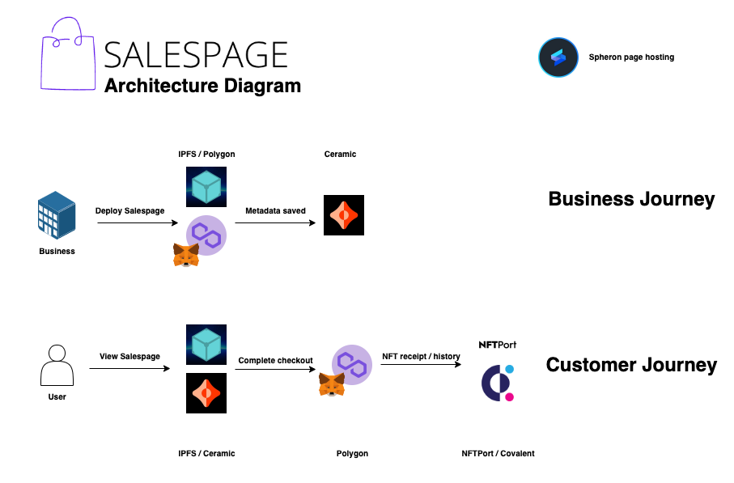
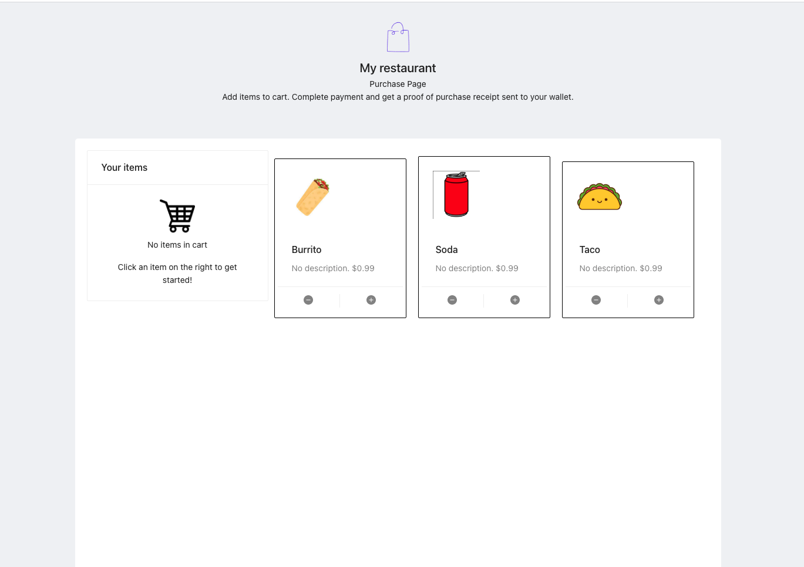

 
 

    

 

## Salespage 

A Point of Sale platform built on Polygon and web3 storage.

Inspired by platforms such as Square, Clover, and Toast - Salespage creates a Point of Sale (POS) management platform built on Polygon smart contracts to enable merchants of any size to create their own in-store purchase pages.

Every purchase gets emitted as a smart contract event and transactions are generated as NFTs with receipts that can be presented in-store as proof of purchase.

Live demo: <a href="https://salespage-ekhr49.spheron.app/" target="_blank">here</a>

<b>Note must be connected to Mumbai network if using default build configuration.</b>

Video: <a href="https://youtu.be/DJ0-LxWRJ_U" target="_blank">Demo video</a>

## Pain points:

- Many of these existing providers don't integrate cryptocurrency as payment methods.
- Existing Providers aren't distributed and suffer downsides of existing centralized platforms (vendor lock in, variable pricing, outages, credit card fees).
- Existing providers often have monthly fees regardless of usage.
- Often transaction history entrusted to a centralized authority vs. blockchain used a decentralized permanent record-keeping system of transactions.

### Features

- Upload images and descriptions for the live page. Metadata for each page is delivered via a Ceramic stream and is hosted without fees for the end user.
- Show sharable product pages and images hosted on IPFS using distributed delivery and hosting.
- Integrated pricing and checkout using Unlock protocol (other payment integrations could also be added).
- Create a new wallet to support payments to help new businesses adopt and receive cryptocurrency payments.
- IPFS powered storage and transaction record keeping.
- Once the payment is complete, the user gets a receipt that they can show to the person in the store/restaurant, but an event also gets fired from the smart contract which could be subscribed to anywhere.

### Technologies used

- IPFS/Filecoin (Hosting and sharing of assets): IPFS and Filecoin are the primary drivers making Salespage possible. Using web3.storage, a storefront or product page creator can host a distributed restaurant menu. The images are pulled down every time a Point of Sale page is rendered on a device using IPFS addressing.
- Polygon: Smart contract 'Salespage' (see contracts folder) representing a unique store front. Each deployed restaurant/retail page gets a distinct smart contract that emits an event whenever a customer completes a purchase.
- Ceramic: Used for storefront metadata storage and retrieval using streams (community node: https://developers.ceramic.network/run/nodes/community-nodes/). When a product page is accessed, a ceramic stream with the streamId of the page cid is opened and the metadata is rendered with the products from IPFS. Ceramic is invoked when the Salespage contract is first deployed and when the data is retried on Point of sales page render.
- NFTPort: After payment is completed on Polygon, NFTPort generates a receipt that contains information about the items purchased, the name of the merchant, and ties it to the payer's address.
- Covalent: Transaction history against each Salespage. Query the events and transaction receipts generated on a contract url. Covalent enables a reporting system of merchant success (and failure) by aggregating customer purchase transactions and categorizing them by outbound (payable) or inbound (receivable).
- Spheron: Hosted on IPFS and Pinata, used Spheron Application hosting for the user-facing app demo.

### Architecture Diagram

    

### How to run

Define the following env variables

<pre>
    REACT_APP_STORAGE_KEY = {YOUR_WEB3_STORAGE_KEY} #web3.storage api key
    REACT_APP_COVALENT_KEY = {YOUR_COVALENT_API_KEY} # covalent api key
    REACT_APP_NFT_PORT_KEY = {YOUR_NFT_PORT_API_KEY} # nft port key (client side mint currently)
    REACT_APP_SALESPAGE_INFURA_KEY = {YOUR_INFURA_API_KEY} # for client-side RPC calls.
</pre>

`yarn; yarn start`

<!-- Example simple checkout page already hosted on IPFS: http://localhost:3000/page/bafybeid67zzz5auzpc2botitsrp2lh2ybutnqkw3mej4s6dlrkthhmis5q -->

<!--
Demo flow:
1. Intro (compare with toast)
2. Assets (IPFS / filecoin / polygon)
3. Upload (IPFS / filecoin)
4. Generate CID with hosted content (IPFS / filecoin / ceramic)
7. Show salespage (ceramic / ipfs / polygon)
8. Show NFT receipt (NFTport).
9. History page of transactions.

### Enhancements

-->

## Screenshots

### Salespage

### Creating a new point of sale page

### Uploading items

### Assets hosting

### Salespage created

### Basic storefront

### Modifying an item during purchase

### Completing payment

### Every Salespage gets deployed as its own auditable smart contract

### Viewing NFT receipt

### Viewing transaction history of a store (inbound and outbound)

<!--

### Useful links
* https://ethglobal.com/events/hackfs2022/home
* https://ethglobal.com/events/hackfs2022/prizes

### Other links
* https://www.notion.so/Prizes-HackFS-d2aeebcda5694c7a9c06dc7aa2b7a2d8
* https://www.qr-code-generator.com/qr-code-api/?target=api-ad

React
* https://www.npmjs.com/package/react-catalog-view
* https://www.npmjs.com/package/react-image-gallery

-->
